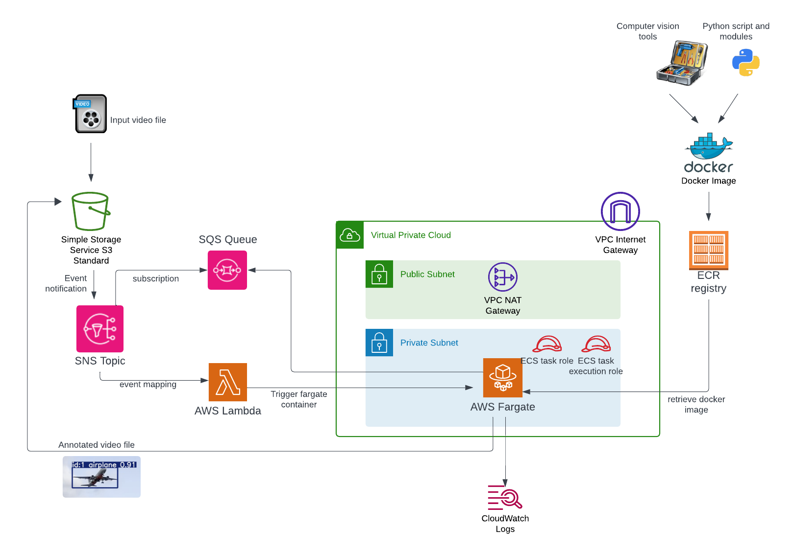

# Overview  

Please see blog site (https://devbuildit.com/2024/09/15/computer-vision-intro/) for detailed explaination of this repo contents.

This repo (and associated blog) will help you to setup an environment to conduct computer vision experiments using AWS infrastructure. The base infrastructure is shown below;

# Installation  

Please see https://devbuildit.com/2024/09/15/computer-vision-intro/ for detailed explaination.

## Requirements: ##
- AWS Account
- Terraform CLI installed with access to your target AWS account (via temporary Indentity centre credentials or AWS IAM access keys)

## Deployment (Terraform)
- Clone repo into a source folder
- Change into subfolder 'TF'
- Update file variable.tf with default region (otherwise this will deploy to ap-southeast-2 by default) and required vpc networking CIDRs
- Consider changing application name in file variables.tf (default will work fine)
- Run command 'Terraform init' in source folder
- Run command 'Terraform plan' in source folder
- Run command 'Terraform apply' in source folder and approve apply

## Deployment (Docker Image)
- Clone repo into a source folder
- Change into subfolder 'Docker'
- Update variables in deploy.sh
- Run Bash command deploy.sh to create local docker image and upload to AWS ECR 

## Removal
- Empty contents of S3 bucket
- Remove images from AWS ECR
- Run command 'Terraform destroy'